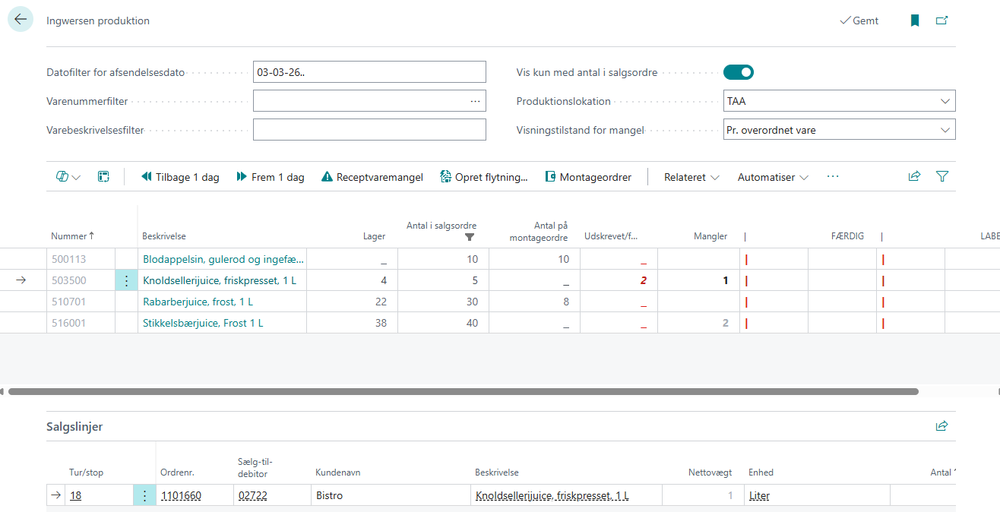

# Ingwersen Produktion

Siden "Ingwersen Produktion" er den daglige produktionsplanlægningskladde. Den viser alle produktionsvarer (Produktionsbogføringsgruppe = `PROD`), deres salgsordrebehov, aktuel lagerbeholdning og montageordredækning. Fra denne ene side kan produktionspersonalet se, hvad der skal produceres, oprette montageordrer og udskrive produktlabels.

Siden husker dine filterindstillinger mellem sessioner.

---

## Filtre

Filterområdet øverst på siden bestemmer, hvilke varer og ordrer der bliver vist på produktskærmen, samt hvordan tilknyttede funktionssider opfører sig.



Efter filtervalgene vises der en oversigt med de produktionsvarer, som opfylder kriterierne. Hvilke varer du ser, afhænger direkte af filtrene.

Nederst i billedet vises for hver valgt vare de tilhørende salgslinjer, så du hurtigt kan se, hvilke ordrer og behov varen dækker.

<div style="page-break-after: always;"></div>

| Filter | Beskrivelse |
|--------|-------------|
| **Datofilter for afsendelsesdato** | Angiver produktionsdatoen. Sættes til **i dag** når siden åbnes. Understøtter BC-datosymboler (f.eks. `d` for i dag, `a` for arbejdsdato). Internt sættes et åbent filter (`dato..`) på varens datofilter, så al efterspørgsel fra denne dato og frem medtages. |
| **Varenummerfilter** | Filtrerer efter varenummer. Brug opslag-knappen til at åbne varelisten og vælge en eller flere varer. |
| **Varebeskrivelsesfilter** | Fritekst-søgning på varebeskrivelsen. Flere ord adskilles med mellemrum og kombineres med OG-logik — alle ord skal forekomme i beskrivelsen. |
| **Vis kun med antal i salgsordre** | Når aktiveret skjules varer, der har nul antal på salgsordrer for det valgte datointerval. Nyttigt til kun at fokusere på varer, der skal produceres. |
| **Produktionslokation** | Filtrerer lagerberegninger til en bestemt lokation. Når den er sat, beregnes alle lagerrelaterede felter (Beholdning, Antal i salgsordrer osv.) kun for den pågældende lokation. |
| **Visningstilstand for mangel** | Styrer, hvordan siden Receptvaremangel (åbnet via handlingen Receptvaremangel) viser resultater: **Oversigt** grupperer mangler pr. komponent, **Pr. overordnet vare** viser detaljeret opdeling pr. overordnet produktionsvare. |

---
<div style="page-break-after: always;"></div>

## Produktionsvarer (gitter)

Hovedoversigten viser én linje pr. produktionsvare. Alle antalsfelter respekterer datofilter og lokationsfilter.

| Kolonne | Beskrivelse |
|---------|-------------|
| **Nr.** | Varenummeret. Skrivebeskyttet. |
| **Beskrivelse** | Varebeskrivelsen. Skrivebeskyttet. Klik på **assist-edit**-knappen (`...`-ikonet) for at åbne styklistens komponenter for denne vare — en hurtig måde at se råvarer/ingredienser. |
| **Beholdning** | Aktuel lagerbeholdning. Skrivebeskyttet, vist nedtonet. |
| **Antal i salgsordrer** | Samlet antal på åbne salgsordrer for det filtrerede datointerval. Skrivebeskyttet. |
| **Antal i montageordrer** | Antal allerede afsat til montageordrer (dvs. produktion er allerede planlagt). Skrivebeskyttet. |
| **Udskrevet/færdig** | Viser, hvor mange labels der er udskrevet (afledt af et gemt antal). Vist med rød tekst. |
| **Mangler** | Beregnet: `Antal i salgsordrer - (Beholdning + Antal i montageordrer)`, minimum 0. Dette er det antal, der stadig skal produceres. Vist med **fed skrift**. |
| **FÆRDIG** | Redigerbart inputfelt. Indtast et antal og tryk Enter eller Tab for at oprette en montageordre. Se [Oprettelse af montageordrer](#oprettelse-af-montageordrer-færdig-kolonnen) nedenfor. |
| **LABELS** | Redigerbart inputfelt. Indtast et antal og tryk Enter eller Tab for at udskrive labels. Klik på assist-edit-knappen for at se loggen over udskrevne labels for denne vare. Se [Udskrivning af labels fra varerækken](#udskrivning-af-labels-fra-varerækken) nedenfor. |

---

## Oprettelse af montageordrer (FÆRDIG-kolonnen)

FÆRDIG-kolonnen er den primære måde at registrere produktion på. Når du indtaster et antal:

1. En ny **montageordre** oprettes for den aktuelle vare
2. Ordreantallet sættes til det indtastede tal
3. **Bogføringsdato** og **Forfaldsdato** sættes begge til datoen fra datofilterets
4. BC genererer automatisk **montagelinjer** ud fra varens montagestykliste (BOM)
5. Alle montagelinjes forfaldsdatoer opdateres til at matche hovedet
6. FÆRDIG-feltet nulstilles til **0**, og siden opdateres
7. Kolonnen **Antal i montageordrer** opdateres med den nye ordre, og **Mangler** falder tilsvarende

### Eksempel

Hvis en vare har Antal i salgsordrer = 50, Beholdning = 10, og Antal i montageordrer = 0:
- Mangler viser **40**
- Du indtaster **40** i FÆRDIG
- En montageordre på 40 oprettes
- Mangler falder til **0**

---

## Udskrivning af labels fra varerækken

LABELS-kolonnen i varegitteret udskriver labels på **vareniveau** (ikke pr. salgslinje). Når du indtaster et antal:

1. Systemet kontrollerer varens **Producentkode** for bogstavet `T`
   - Hvis `T` findes: rapporten **Item Label - transparent** køres
   - Ellers: standardrapporten **Item Label** køres
2. En logpost skrives til [loggen over udskrevne labels](#log-over-udskrevne-labels) med `Fra vare = ja`
3. LABELS-feltet nulstilles til **0**

---

## Salgslinjer (underside i bunden)

Under varegitteret viser en underside alle **salgsordrelinjer** for den aktuelt valgte vare, filtreret efter datofilterets. Dette giver overblik over, hvilke kunder der har behov for dette produkt, og hvor meget.

### Kolonner i undersiden

| Kolonne | Beskrivelse |
|---------|-------------|
| **Rute/Stop** | Leveringsrutekoden for denne ordre. Skrivebeskyttet. |
| **Ordrenr.** | Salgsordredokumentnummeret. Skrivebeskyttet. |
| **Sælg-til-debitor** | Debitornummeret. Skrivebeskyttet. |
| **Kundenavn** | Kundens navn (slået op fra debitortabellen). Skrivebeskyttet. |
| **Beskrivelse** | Salgslinjens beskrivelse. Skrivebeskyttet. |
| **Nettovægt** | Nettovægt for varen på denne linje. Skrivebeskyttet. |
| **Enhed** | Enhedskoden. Skrivebeskyttet. |
| **Antal** | Det udestående (endnu ikke leverede) antal. Skrivebeskyttet. |
| **Afsendelsesdato** | Den planlagte afsendelsesdato. Skrivebeskyttet. |
| **Udskrevet** | Viser datoen for, hvornår labels blev udskrevet for denne salgslinje. Når labels udskrives, sættes denne til dags dato. Når feltet er tomt, er der endnu ikke udskrevet labels. |
| **LABELS** | Redigerbart input. Indtast et antal for at udskrive labels for denne specifikke salgslinje. Se nedenfor. |

Linjer med en afsendelsesdato **efter arbejdsdatoen** vises nedtonet for visuelt at adskille fremtidige ordrer fra dagens ordrer.

### Udskrivning af labels fra en salgslinje

Når du indtaster et antal i salgslinjens LABELS-kolonne:

1. Systemet kontrollerer varens **Producentkode** for bogstavet `T`
   - Hvis `T` findes: rapporten **Item Label - transparent** køres (inkluderer debitornummer og navn)
   - Ellers: standardrapporten **Item Label** køres (inkluderer debitornummer og navn)
2. Kolonnen **Udskrevet** sættes til **dags dato**, og linjen markeres som "labels udskrevet"
3. En logpost skrives til [loggen over udskrevne labels](#log-over-udskrevne-labels) med `Fra vare = nej`
4. LABELS-feltet nulstilles til **0**

**For at fjerne "udskrevet"-markeringen**: Indtast **0** i LABELS-kolonnen. Dette fjerner datoen fra Udskrevet-kolonnen.

### Forskel: Varelabels vs. salgslinje-labels

| | Vare-LABELS | Salgslinje-LABELS |
|---|---|---|
| **Omfang** | Udskriver for varen generelt | Udskriver for en specifik kundes ordrelinje |
| **Kundeinfo** | Ikke inkluderet på labelen | Debitornummer og navn udskrives på labelen |
| **Udskrevet-indikator** | Ingen markering på siden | Sætter "Udskrevet"-datoen på salgslinjen |
| **Logpost** | `Fra vare = ja` | `Fra vare = nej` |

---
<div style="page-break-after: always;"></div>

## Handlinger

### Fremhævede handlinger (handlingslinjen)

| Handling | Genvej | Beskrivelse |
|----------|--------|-------------|
| **Tilbage 1 dag** | `Ctrl+PgUp` | Flytter datofilterets én dag tilbage. |
| **Frem 1 dag** | `Ctrl+PgDn` | Flytter datofilterets én dag frem. |
| **Receptvaremangel** | `Ctrl+Shift+B` | Åbner siden Receptvaremangel. Denne beregner, hvilke råvarer og komponenter der har utilstrækkelig lagerbeholdning til at producere den resterende mængde på tværs af alle synlige varer. Visningstilstanden styres af filteret Visningstilstand for mangel. |
| **Opret flytning** | — | Opretter et **Intern flytning**-dokument for fysisk at flytte komponenter fra lagerpladser til produktions-/montagepladsen. Viser en bekræftelsesdialog først. Hvis nogle komponenter ikke kan dækkes fuldt ud fra tilgængelige pladser, åbnes flytningen, og mangeladvarsler vises. |
| **Montageordrer** | `Ctrl+K` | Åbner montageordrer for den aktuelle vare på den aktuelle dato. Hvis der findes præcis **én** ordre, åbnes montageordrekortet direkte. Hvis der er flere, åbnes montageordrelisten. |

### Navigeringshandlinger

| Handling | Genvej | Beskrivelse |
|----------|--------|-------------|
| **Vare - rediger** | `Ctrl+F4` | Åbner varekortet for den valgte vare. |
| **Vareposter** | `Ctrl+F7` | Åbner vareposterne for den valgte vare, sorteret efter bogføringsdato (nyeste først). |
| **Råvarer (F8)** | `F8` | Åbner styklistekomponentlisten med alle ingredienser/komponenter for den valgte vare. |
| **Interne flytninger** | — | Åbner siden Intern flytningsoversigt (alle flytninger, ikke filtreret). |

---

## Log over udskrevne labels

Hver labeludskrivning — uanset om den er fra varerækken eller en salgslinje — logges i tabellen **Udskrevet/færdig** (50108). Hver post registrerer:

| Felt | Beskrivelse |
|------|-------------|
| **Løbenr.** | Automatisk stigende sekvensnummer. |
| **Prod.dato** | Udskrivningstidspunktet. |
| **Varenr.** | Den vare, som labels blev udskrevet for. |
| **Antal udskrevet** | Antallet af udskrevne labels. |
| **Fra vare** | `ja` = udskrevet fra varerækken. `nej` = udskrevet fra en salgslinje. |

For at se loggen: klik på **assist-edit**-knappen på LABELS-feltet i varegitterrækken. Dette åbner siden Udskrevet/færdig filtreret til den aktuelle vare og dato.

---

## Typisk daglig arbejdsgang

1. **Åbn siden** — den sættes som standard til dags dato og viser alle produktionsvarer
2. **Gennemgå kolonnen Mangler** — varer med værdier > 0 kræver produktion
3. **Tjek Receptvaremangel** (`Ctrl+Shift+B`) — verificér, at der er tilstrækkeligt med råvarer
4. **Opret flytning** — flyt nødvendige komponenter til produktionspladsen
5. **Indtast antal i FÆRDIG** — efterhånden som varer produceres, indtastes antallet for at oprette montageordrer
6. **Udskriv labels** — brug LABELS-kolonnen (enten på vareniveau eller pr. salgslinje) til at udskrive produktlabels
7. **Navigér mellem datoer** — brug `Ctrl+PgUp` / `Ctrl+PgDn` til at tjekke foregående eller kommende dage

---

## Tastaturgenveje

| Genvej | Handling |
|--------|----------|
| `Ctrl+PgUp` | Tilbage 1 dag |
| `Ctrl+PgDn` | Frem 1 dag |
| `Ctrl+Shift+B` | Åbn Receptvaremangel |
| `Ctrl+K` | Åbn montageordrer for aktuel vare |
| `Ctrl+F4` | Åbn varekort |
| `Ctrl+F7` | Åbn vareposter |
| `F8` | Åbn styklistekomponenter (Råvarer) |

---

## Sådan beregnes mangelantal

Både **Receptvaremangel**-siden og handlingen **Opret flytning** tager udgangspunkt i det samme produktionsantal, men de beregner mangler forskelligt.

### Trin 1: Produktionsantal (fælles for begge)

For hver produktionsvare beregner systemet **Mangler** — hvor meget der stadig skal produceres:

```
Mangler = Antal i salgsordrer - (Beholdning + Antal i montageordrer)
```

- **Antal i salgsordrer**: samlet efterspørgsel fra åbne salgsordrer (fra datofilteret og frem)
- **Beholdning**: aktuel lagerbeholdning
- **Antal i montageordrer**: antal allerede afsat til montageordrer (produktion er allerede planlagt)

Kun varer, hvor Mangler > 0, behandles videre. Denne formel er identisk i begge beregninger.

### Trin 2: Styklisteeksplosion (fælles for begge)

For hver vare med Mangler > 0 "eksploderer" systemet montagestyklisten — det gennemgår alle komponenter og underkomponenter rekursivt:

- For hver komponent: `Nødvendigt antal = Mangler x Antal pr. (akkumuleret gennem styklisteniveauer)`
- Hvis en komponent selv har en montagestykliste, fortsætter eksplosionen ned i underkomponenterne
- Cirkulære referencer opdages og forhindres

### Trin 3a: Receptvaremangel — kontrol mod varebeholdning

Receptvaremangel-siden kontrollerer komponentmangler mod **varebeholdning** (den samlede lagerbeholdning af hver komponent på den filtrerede lokation):

1. **Aggregér efterspørgsel**: Alle nødvendige antal for samme komponent på tværs af alle overordnede varer summeres. Hvis f.eks. Overordnet vare A har brug for 10 og Overordnet vare B har brug for 15 af Komponent X, er den samlede efterspørgsel 25.
2. **Kontrollér beholdning én gang**: Komponentens beholdning hentes én gang (med respekt for produktionslokationsfilteret).
3. **Beregn mangel**: `Mangel = Samlet nødvendigt antal - Beholdning`. Hvis beholdningen er 12 og den samlede efterspørgsel er 25, er manglen 13.
4. **Fordel proportionalt**: Manglen fordeles på de overordnede varer proportionalt med deres efterspørgsel. Overordnet vare A får `10/25 x 13 = 5,2` i mangel, Overordnet vare B får `15/25 x 13 = 7,8` i mangel.
5. **Ingen mangel = ingen post**: Hvis en komponent har nok beholdning til at dække alle overordnede varer, vises den slet ikke i listen.

Visningen **Oversigt** grupperer pr. komponent og viser den samlede mangel. Visningen **Pr. overordnet vare** viser den proportionale fordeling.

### Trin 3b: Opret flytning — kontrol mod pladsindhold

Handlingen Opret flytning kontrollerer komponenttilgængelighed mod **pladsindhold** — den faktiske fysiske beholdning i lagerpladser:

1. **Aggregér efterspørgsel**: Samme som Receptvaremangel — alle nødvendige antal for samme komponent summeres på tværs af overordnede varer.
2. **Kontrollér pladsindhold**: For hver komponent gennemgår systemet alle pladser på produktionslokationen (undtagen destinationspladsen) og beregner tilgængeligt antal: `Tilgængeligt = Antal (basis) - Plukantal (basis) - Negativ regulering (basis)`.
3. **Opret flytningslinjer**: Flytningslinjer oprettes fra hver plads, der har tilgængeligt antal, indtil det nødvendige antal er opfyldt.
4. **Mangel = uopfyldt efterspørgsel**: Hvis alle pladser tilsammen ikke kan levere nok, rapporteres det resterende uopfyldte antal som en mangel.

### Hvorfor tallene kan være forskellige

| | Receptvaremangel | Opret flytning |
|---|---|---|
| **Kontrollerer mod** | Varebeholdning (samlet beholdning på lokationen) | Pladsindhold (beholdning i specifikke pladser, ekskl. destinationspladsen) |
| **Tilgængeligt betyder** | Samlet beholdning på den filtrerede lokation | Fysisk plukbart antal på tværs af pladser |
| **Kan være forskelligt fordi** | Beholdning inkluderer beholdning på destinationspladsen og reserveret beholdning | Tæller kun beholdning på pladser ud over produktionspladsen, minus igangværende pluk |

I praksis kan Receptvaremangel-siden vise **færre** mangler end Opret flytning, hvis komponentbeholdning findes på destinationspladsen (som er udelukket fra flytningskilder). Omvendt kan Receptvaremangel vise **flere** mangler, hvis plads-tilgængeligheden afviger fra den samlede beholdning.

---

## Tekniske noter

Siden genbruger flere standard BC-felter til tilpassede formål:

- **Item."Maximum Inventory"** — gemmer et labeludskrivningsantal, der vises (rundet op) i kolonnen "Udskrevet/færdig"
- **SalesLine."Promised Delivery Date"** — bruges som et "labels udskrevet"-flag; sættes til dags dato, når labels udskrives for en salgslinje
- **SalesLine."Qty. to Invoice"** — bruges midlertidigt under labeludskrivning til at overføre labelantallet til rapporten
